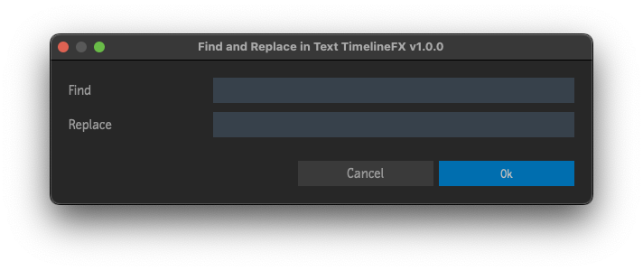

# Find and Replace in Text Timeline FX
Plugin for [Autodesk Flame](http://www.autodesk.com/products/flame)

Find and replace text inside of Text Timeline FX without having to enter the Text editor.  Works on segments or sequences containing segments with Text Timeline FX applied.  If the segment is hidden, it will be skipped.

## Compatibility
|Script Version|Flame Version|
|---|---|
|v3.X.X|Flame 2025 and up|
|v2.X.X|Flame 2022 up to 2024.2|
|v1.X.X|Flame 2021 up to 2021.2|

## Installation

### Flame 2025 and newer
To make available to all users on the workstation, copy `apply_text_timeline_fx_to_segments.py` to `/opt/Autodesk/shared/python/`

For specific users, copy `apply_text_timeline_fx_to_segments.py` to the appropriate path below...
|Platform|Path|
|---|---|
|Linux|`/home/<user_name>/flame/python/`|
|Mac|`/Users/<user_name>/Library/Preferences/Autodesk/flame/python/`|

### Flame 2021 up to 2024.2
To make available to all users on the workstation, copy `apply_text_timeline_fx_to_segments.py` to `/opt/Autodesk/shared/python/`

For specific users, copy `apply_text_timeline_fx_to_segments.py` to `/opt/Autodesk/user/<user name>/python/`

### Last Step
Finally, inside of Flame, go to Flame (fish) menu `->` Python `->` Rescan Python Hooks

## Menus
 - Right-click selected segments in a Sequence `->` Edit... `->` Find and Replace in Text Timeline FX
 - Right-click selected sequences on the Desktop `->` Edit... `->` Find and Replace in Text Timeline FX
 - Right-click selected sequences in the Media Panel `->` Edit... `->` Find and Replace in Text Timeline FX

## Acknowledgements
Influenced by [Flameslate PHP script](http://github.com/ManChicken1911/flameslater)

UI Templates courtesy of [pyflame.com](http://www.pyflame.com)
